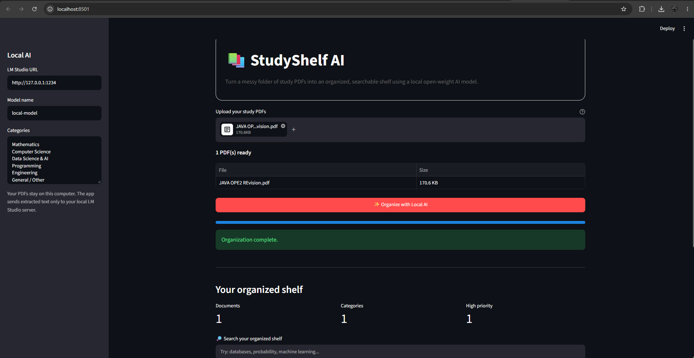

# StudyShelf AI

> Turn a messy collection of study PDFs into an organized, searchable study shelf using local open-weight AI.

StudyShelf AI is a lightweight, local-first study document organizer built for a friend who has a large collection of scattered study PDFs.

Instead of manually opening files to figure out what they contain, StudyShelf extracts their text locally and uses a locally running open-weight language model to organize each document by category, tags, priority, and summary.

## Demo

[](https://drive.google.com/file/d/1q64ynhZF2pMHWX_bANhDKShb16rIvD0h/view?usp=sharing)

Click the image above to watch the demo.
---

## The Problem

A large study folder can quickly become difficult to manage.

File names can be inconsistent, similar documents can be mixed together, and it can be difficult to remember which PDF contains a particular topic.

StudyShelf AI was built around a simple real-world problem:

> **How can a student turn a messy folder of study PDFs into something they can quickly understand and search?**

The goal is not to replace a learning platform. It is to make an existing collection of study material easier to navigate.

---

## What StudyShelf AI Does

A user uploads one or more study PDFs. StudyShelf then:

1. Extracts selectable text from each PDF locally using PyMuPDF.
2. Sends the extracted text to a local LM Studio server.
3. Uses an open-weight language model to classify the document.
4. Generates a subject/category, 3-5 tags, priority, and a short summary.
5. Displays the results as a searchable study shelf.
6. Allows the organized index to be exported as a CSV file.

### Example

A document containing database notes might be organized as:

```text
Category: Computer Science
Priority: High
Tags: SQL, databases, normalization, transactions
Summary: A concise overview of relational database concepts...
```

---

## Why Local Open-Weight AI?

The project deliberately uses local AI instead of requiring a hosted AI API for its core document-analysis task.

Study material can contain private notes, assignments, personal annotations, or other information that a user may not want to send to a third-party AI service.

With StudyShelf AI, the flow is:

```text
PDF
  ↓
Local text extraction
  ↓
LM Studio local server
  ↓
Open-weight language model
  ↓
Category + tags + priority + summary
  ↓
Searchable study shelf
```

The model inference happens on the user's computer through LM Studio.

The application therefore does not require an OpenAI, Gemini, or other hosted AI API for the organization step.

This provides:

- Local document processing
- Greater control over the AI model
- No per-request cloud AI costs
- A more privacy-friendly workflow for personal study material
- The ability to change the local model without rebuilding the application

Open-weight AI is therefore part of the actual architecture rather than being added only for the challenge.

---

## Features

- Batch PDF upload
- Local PDF text extraction
- AI-generated subject/category
- AI-generated tags
- High/Medium/Low priority classification
- Short document summaries
- Search across organized documents
- CSV study index export
- Local open-weight AI inference
- No cloud AI API required for document organization

---

## Tech Stack

| Technology | Purpose |
|---|---|
| Python | Application logic |
| Streamlit | Web interface |
| PyMuPDF | PDF text extraction |
| Requests | Communication with the local AI server |
| Pandas | Tables and CSV export |
| LM Studio | Local model serving |
| Qwen3.8 9B | Open-weight language model used for the demo |

---

## Architecture

```text
                         StudyShelf AI
                              │
                              │
                       Upload PDF files
                              │
                              ▼
                          PyMuPDF
                     Local text extraction
                              │
                              ▼
                   LM Studio Local Server
                    http://127.0.0.1:1234
                              │
                              ▼
                     Qwen3.8 9B Q5_K_M
                              │
                              ▼
                  Structured AI organization
                              │
              ┌───────────────┼───────────────┐
              ▼               ▼               ▼
          Category           Tags          Priority
                              │
                              ▼
                           Summary
                              │
                              ▼
                    Searchable Study Shelf
                              │
                              ▼
                         CSV Export
```

---

## How the AI Works

StudyShelf does not send the entire PDF directly to a cloud AI service.

First, PyMuPDF extracts selectable text from the PDF locally.

The application then sends a controlled excerpt of that text to the local LM Studio API with a structured instruction asking the model to return:

```json
{
  "category": "Computer Science",
  "tags": [
    "SQL",
    "databases",
    "normalization",
    "transactions"
  ],
  "priority": "High",
  "summary": "A concise overview of relational database concepts."
}
```

The returned information is then displayed in the StudyShelf interface.

This keeps the AI's role focused on document organization rather than requiring a large cloud-based application architecture.

---

## Running Locally

### Requirements

You need:

- Python 3.10 or newer
- LM Studio
- An open-weight instruct/chat model supported by LM Studio
- Enough system memory/GPU memory for the selected model

The project does not bundle a language model.

The model is loaded separately in LM Studio.

---

### 1. Clone the repository

```bash
git clone https://github.com/MANAV-MISHRA-BYTES/StudyShelf-AI.git
cd StudyShelf-AI
```

---

### 2. Create a virtual environment

#### Windows

```powershell
python -m venv .venv
.venv\Scripts\activate
```

#### macOS/Linux

```bash
python3 -m venv .venv
source .venv/bin/activate
```

---

### 3. Install dependencies

```bash
pip install -r requirements.txt
```

The Python dependencies are:

```text
streamlit
pymupdf
requests
pandas
```

---

### 4. Start LM Studio

Open LM Studio.

Load an open-weight instruct/chat model.

For the demo, StudyShelf AI was tested with:

```text
Model: qwen3.8-9b-distill
Quantization: Q5_K_M
```

Then open:

```text
Developer → Local Server
```

Start the local server.

The default endpoint used by StudyShelf is:

```text
http://127.0.0.1:1234
```

Keep LM Studio running while using StudyShelf.

---

### 5. Start StudyShelf AI

From the project directory:

```bash
streamlit run app.py
```

Streamlit will open the application in your browser.

---

### 6. Configure the local model

In the StudyShelf sidebar, enter:

```text
LM Studio URL:
http://127.0.0.1:1234
```

For the demo model:

```text
Model name:
qwen3.8-9b-distill
```

The model name must match the API model identifier shown by your LM Studio server.

---

### 7. Upload PDFs

Upload one or more text-based study PDFs.

Then click:

**Organize with Local AI**

StudyShelf will extract the text, send it to the local model, and display the generated organization information.

---

## Privacy

StudyShelf processes uploaded PDF data inside the running application and extracts selectable text locally.

The extracted text is sent to the LM Studio server configured by the user.

When LM Studio is running locally, the document-analysis request does not need to leave the user's computer for a cloud AI provider.

The project therefore provides a local-first workflow for organizing potentially private study material.

> **Current limitation:** scanned/image-only PDFs are not OCR'd by the current version and may require manual review.

---

## Project Structure

```text
StudyShelf-AI/
│
├── app.py
│   └── Main Streamlit application
│
├── requirements.txt
│   └── Python dependencies
│
├── README.md
│   └── Project documentation
│
├── .gitignore
│   └── Files excluded from Git
│
└── assets/
    └── studyshelf-demo.png
        └── Application screenshot
```

---

## Current Limitations

This is intentionally a small MVP built for the Hacktoberfest challenge.

Current limitations include:

- Scanned/image-only PDFs are not OCR'd.
- Organization results are stored in application memory rather than a permanent database.
- The application currently expects a local LM Studio-compatible API.
- Search operates over generated metadata rather than performing semantic search across the full document collection.
- The application does not currently provide full question-answering/RAG functionality.

These limitations keep the project small while demonstrating the core idea clearly.

---

## Future Improvements

Possible next steps include:

- OCR for scanned PDFs
- Persistent document library
- Folder-based organization
- Semantic search
- RAG-based question answering
- Duplicate document detection
- Study-topic dashboards
- Flashcard generation
- Quiz generation
- Automatic revision scheduling
- Better document previews
- Optional local model server configuration
- Additional open-weight model support

---

## Hacktoberfest 2026

StudyShelf AI was built for the DEV Community **Hacktoberfest Weekend Challenge: Build for a Friend**.

The project focuses on a real study-organization problem and uses open-weight AI at the core of its document-classification workflow.

The project was intentionally kept small enough to build and demonstrate within the challenge period while still providing a useful real-world workflow.

---

## Author

**Manav Mishra**

GitHub: [MANAV-MISHRA-BYTES](https://github.com/MANAV-MISHRA-BYTES)

---

## License

MIT
